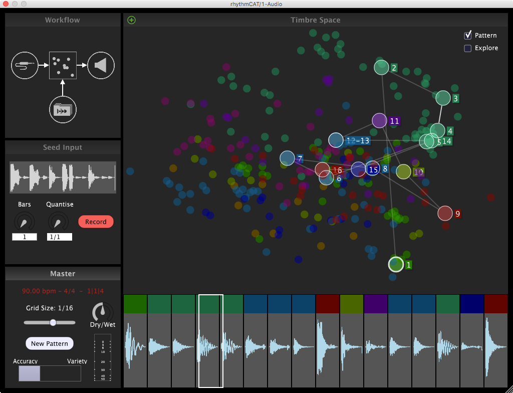

# rhythmCAT

RhythmCAT is a VST software instrument for creating new loops intelligently using existing samples. By capturing a one or two bar target loop within your DAW, you can emulate the timbre and rhythmic pattern of that loop using any other samples of sounds you provide.

To learn more you can see watch this video:
https://www.youtube.com/watch?v=hByhgF_fzto

Or checkout this paper from NIME:

Ó Nuanáin, C., Jordà, S., & Herrera, P. (2016). An Interactive Software Instrument for Real-time Rhythmic Concatenative Synthesis. In New Interfaces for Musical Expression. Brisbane, Australia. [PDF](http://mtg.upf.edu/node/3464)

The plugin is still in active development with a commercial release hopefully coming later this year. A demo version is provided here with a 25 minute timeout.

https://github.com/carthach/rhythmCAT/releases/download/0.1/rhythmCAT.vst.zip

